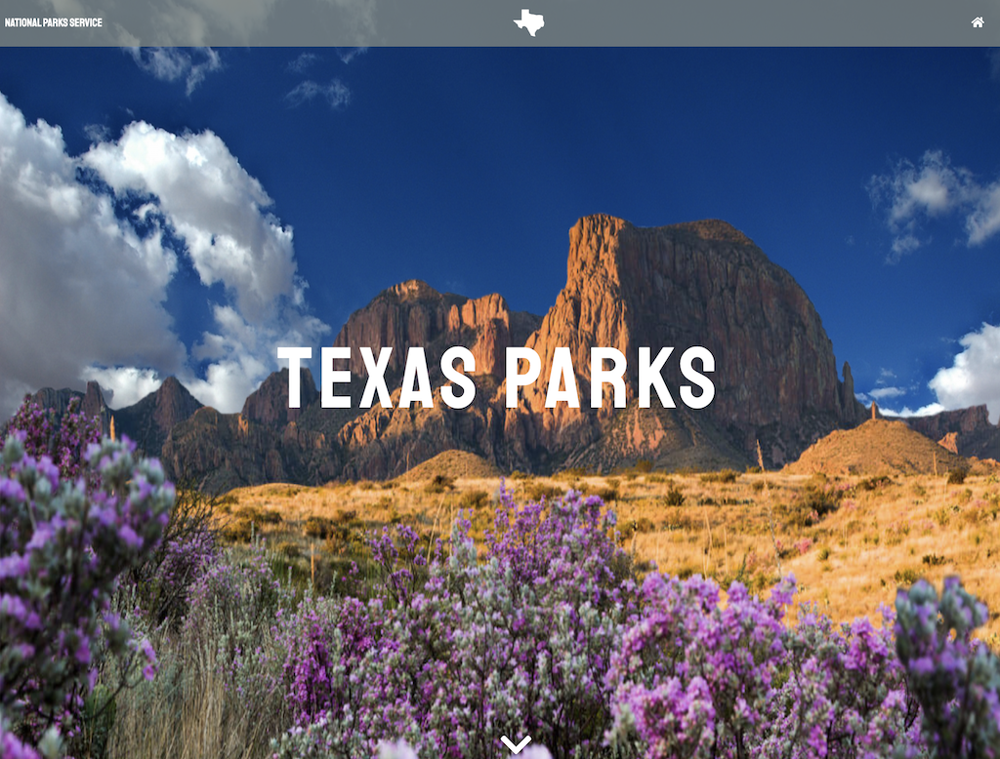

# Parks_n_Req

 This web application is a redesigned camping reservation/park information application inspired by the Texas State Parks reservation system. It is designed to elevate the user experience and streamline the process to be efficient and simple. 

 ### [Check it out!](salty-hamlet-73070.herokuapp.com/) 


 ## Use 
 Load the web app in your browser and scroll down to the image map. Each of the red pins notates a park. Click on desired red pin and a modal will pop up with the parks name and the option to view that parks page or close the modal to choose another park.
 Once a park has been chosen, the park page will have an abundance of information about the park and the correlating campsite, including amenities, regulations, accessibility, contact and so forth. 
 If the park offers reservations, you can click the reservation button and fill out the form. 
 Once the form is completed and submitted, you will be redirected to the reservation confirmation page and be ready to go on your camping excursion!

 ## Installation
 These instructions will get you a copy of the project up and running on your local machine for development and testing purposes. They will also give an overview of some of the app's functionality. 
### Prerequisite
**You will need to have MySQL installed on your machine to use this locally**
````
https://dev.mysql.com/doc/mysql-installation-excerpt/5.7/en/installing.html
````
Once you've ensured that MySQL is installed, you will need to clone the repository to your local machine

````
git clone https://github.com/ashlinhanson/Parks_n_Req.git
````

Then you will need to install the dependencies needed to run the application
````
npm install
````
and add your password to config.json
````
"username": "root",
"password": "",
````

and finally run in the command line
````
node server
````
and it open the browser and run the application

 ## Technologies Used
 HTML5
 CSS3
 Bootstrap4
 ScrollTrigger By GSAP
 JavaScript
 jQuery
 MySQL
 Sequelize
 Node.js
 Express.js

  ## Contributors 
 Steve Rodriguez : Back-end 
 Lili Clift : Back-end & Front-end 
 Ashli Hanson : Front-end 
 Nay Wilkins : Front-end 
 ## License  [](http://unlicense.org/) 
 Copyright (c) 2020 Parks_n_Req Licensed under the Unlicense license.